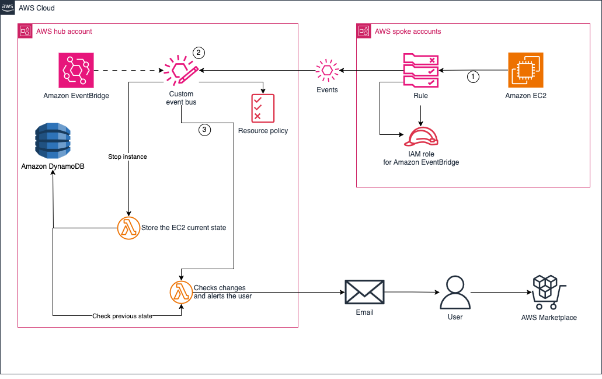

# AWS Marketplace EC2 Instance Type Change Monitor



## Overview

This solution monitors EC2 instance type changes for AWS Marketplace subscriptions and sends email alerts when customers change instance types that may not be covered by their current marketplace agreement.

### What It Does

- **Monitors** all EC2 instances launched from AWS Marketplace AMIs
- **Tracks** instance type changes (BEFORE → AFTER)
- **Validates** if the old instance type is covered by your active marketplace agreement
- **Alerts** via email when changes occur that may require agreement amendments
- **Records** all changes in DynamoDB with 90-day retention

### Use Cases

**Default Behavior (Agreement Validation Enabled):**
- Alerts you when an instance type change occurs and the OLD type was valid in your agreement
- Helps you amend your marketplace agreement to avoid unexpected on-demand charges
- Example: You have an agreement for `m5.large`, change to `m5.xlarge` → Email sent to amend agreement

**Alternative Behavior (Skip Agreement Verification):**
- Set `SkipAgreementVerification=true` to receive alerts for ALL marketplace instance type changes
- Useful for general monitoring without agreement validation

## Architecture

### Hub Account
- **DynamoDB Table**: Stores instance state and change history
- **Lambda Function**: Processes events and validates agreements
- **EventBridge**: Receives events from spoke accounts
- **CloudTrail**: Captures API calls
- **SES**: Sends email notifications (optional)

### Spoke Account(s)
- **CloudTrail**: Captures EC2 API calls
- **EventBridge**: Forwards events to hub account

## How It Works

1. **Instance Stops** → EventBridge captures state change (real-time) → Records current instance type
2. **Instance Type Modified** → EventBridge → Lambda validates and records change → Sends email if needed

**Note:** Instance type changes are captured via CloudTrail events delivered to EventBridge in real-time.

**Important:** Instances that are already stopped when the solution is deployed will not be tracked. The instance must stop at least once after deployment for its type to be captured.

## Prerequisites

- AWS Organization (required - solution only works within the same organization)
- AWS CLI configured with appropriate credentials
- CloudFormation permissions in hub and spoke accounts
- SES verified email addresses (if using email notifications)

## Deployment

### Step 1: Deploy Hub Account Stack

```bash
aws cloudformation deploy \
  --template-file hub-account-template.yaml \
  --stack-name ec2-monitoring-hub \
  --capabilities CAPABILITY_IAM \
  --parameter-overrides \
    EmailFrom="verified-sender@example.com" \
    EmailRecipient="recipient@example.com" \
    EnableEmailNotifications="true" \
    SkipAgreementVerification="false" \
  --region us-east-1
```

**Parameters:**
- `EmailFrom`: SES verified sender email address
- `EmailRecipient`: Email address to receive alerts
- `EnableEmailNotifications`: Set to `true` to enable email alerts
- `SkipAgreementVerification`: Set to `true` to receive alerts for ALL instance type changes on marketplace instances, without validating whether the old type was covered by your agreement"

**Note:** The stack automatically detects your AWS Organization ID and configures the EventBus to only accept events from accounts within your organization.

**After deployment, note the outputs:**
```bash
aws cloudformation describe-stacks \
  --stack-name ec2-monitoring-hub \
  --query 'Stacks[0].Outputs' \
  --region us-east-1
```

You'll see the auto-detected `OrganizationId` and the `EventBusArn` needed for spoke account deployments.

### Step 2: Deploy Lambda Function

The Lambda function code is too large for inline CloudFormation deployment and must be deployed separately:

```bash
# Navigate to the directory containing lambda_function.py
cd /path/to/your/project

# Deploy the Lambda function code
aws lambda update-function-code \
  --function-name ec2-monitoring-hub-Track \
  --zip-file fileb://<(zip -q - lambda_function.py) \
  --region us-east-1
```

**Note:** You must deploy the Lambda code after every CloudFormation stack update, as stack updates reset the function code to a placeholder.

### Step 3: Deploy Spoke Account Stack

If monitoring instances in different accounts, deploy this stack in each spoke account. If the spoke and hub accounts are the same, deploy this CloudFormation stack in the same linked account.

```bash
aws cloudformation deploy \
  --template-file spoke-account-template.yaml \
  --stack-name ec2-monitoring-spoke \
  --capabilities CAPABILITY_IAM \
  --parameter-overrides \
    HubAccountId="YOUR_HUB_ACCOUNT_ID" \
    HubEventBusName="ec2-monitoring-hub-Bus" \
    HubRegion="us-east-1" \
  --region us-east-1
```

### Step 4: Verify SES Email Addresses (If Using Email Notifications)

```bash
# Verify sender email
aws ses verify-email-identity --email-address verified-sender@example.com --region us-east-1

# Verify recipient email
aws ses verify-email-identity --email-address recipient@example.com --region us-east-1
```

Check your email and click the verification links sent by AWS.

## Testing

### Test Instance Type Change

1. **Launch a marketplace instance** (or use an existing one)
2. **Stop the instance** (state captured immediately)
3. **Change the instance type** via AWS Console or CLI
4. **Check your email** for the alert (if notifications enabled)

### Verify DynamoDB Records

```bash
# Get table name
TABLE=$(aws cloudformation describe-stacks \
  --stack-name ec2-monitoring-hub \
  --query 'Stacks[0].Outputs[?OutputKey==`TableName`].OutputValue' \
  --output text \
  --region us-east-1)

# Scan table
aws dynamodb scan --table-name $TABLE --region us-east-1
```

### Check Lambda Logs

```bash
# View recent logs (last hour) - macOS compatible
aws logs filter-log-events \
  --log-group-name /aws/lambda/ec2-monitoring-hub-Track \
  --start-time $(python3 -c "import time; print(int((time.time() - 3600) * 1000))") \
  --region us-east-1

# View all logs (no time filter)
aws logs filter-log-events \
  --log-group-name /aws/lambda/ec2-monitoring-hub-Track \
  --region us-east-1

# Filter for ModifyInstanceAttribute events
aws logs filter-log-events \
  --log-group-name /aws/lambda/ec2-monitoring-hub-Track \
  --filter-pattern "ModifyInstanceAttribute" \
  --region us-east-1

# Filter for errors
aws logs filter-log-events \
  --log-group-name /aws/lambda/ec2-monitoring-hub-Track \
  --filter-pattern "ERROR" \
  --region us-east-1

# Get latest log stream
aws logs describe-log-streams \
  --log-group-name /aws/lambda/ec2-monitoring-hub-Track \
  --order-by LastEventTime \
  --descending \
  --max-items 1 \
  --region us-east-1
```

## DynamoDB Record Structure

### State Capture (When Instance Stops)
```json
{
  "instanceId": "i-1234567890abcdef0",
  "beforeInstanceType": "m5.large",
  "capturedAt": "2026-01-21T12:00:00Z",
  "ttl": 1745328000
}
```

### Change Record (When Instance Type Modified)
```json
{
  "instanceId": "i-1234567890abcdef0",
  "beforeInstanceType": "m5.large",
  "afterInstanceType": "m5.xlarge",
  "capturedAt": "2026-01-21T12:00:00Z",
  "changedAt": "2026-01-21T12:15:00Z",
  "agreementId": "agmt-1234567890abcdef0",
  "agreementName": "PurchaseAgreement",
  "productName": "SUSE Linux Enterprise Server for SAP Applications 15 SP6",
  "productId": "prod-1234567890abc",
  "offerId": "offer-1234567890abc",
  "isTriggeredTheAlert": true,
  "ttl": 1745328000
}
```

## Configuration Options

### Exclude Specific Instances from Monitoring

Add this tag to any EC2 instance to exclude it from monitoring:
```
Key: aws-marketplace-monitor
Value: false
```

### Skip Agreement Verification

To receive alerts for ALL marketplace instance type changes (without agreement validation):

```bash
aws cloudformation update-stack \
  --stack-name ec2-monitoring-hub \
  --use-previous-template \
  --capabilities CAPABILITY_IAM \
  --parameters \
    ParameterKey=EmailFrom,UsePreviousValue=true \
    ParameterKey=EmailRecipient,UsePreviousValue=true \
    ParameterKey=EnableEmailNotifications,UsePreviousValue=true \
    ParameterKey=SkipAgreementVerification,ParameterValue=true \
  --region us-east-1

# Redeploy Lambda code after stack update
aws lambda update-function-code \
  --function-name ec2-monitoring-hub-Track \
  --zip-file fileb://<(zip -q - lambda_function.py) \
  --region us-east-1
```

## Troubleshooting

### Stack Deployment Fails After Deletion

If you encounter `ResourceExistenceCheck` errors when redeploying after stack deletion, some resources may not have been fully cleaned up:

**Common leftover resources:**
- S3 buckets (with versioning enabled require special deletion)
- CloudTrail trails
- EventBridge custom event buses

**Quick fix:**
```bash
# List S3 buckets
aws s3 ls | grep ec2-monitoring

# Delete versioned S3 buckets (use Python script from Clean Up section)
```

For detailed troubleshooting, see [AWS CloudFormation troubleshooting guide](https://docs.aws.amazon.com/AWSCloudFormation/latest/UserGuide/troubleshooting.html).

### No Email Received

1. Check SES email verification status:
```bash
aws ses get-identity-verification-attributes \
  --identities verified-sender@example.com recipient@example.com \
  --region us-east-1
```

2. Verify Lambda environment variables have correct email addresses:
```bash
aws lambda get-function-configuration \
  --function-name ec2-monitoring-hub-Track \
  --region us-east-1 \
  --query 'Environment.Variables'
```

3. Check Lambda logs for SES errors:
```bash
aws logs filter-log-events \
  --log-group-name /aws/lambda/ec2-monitoring-hub-Track \
  --filter-pattern "MessageRejected" \
  --region us-east-1
```

4. Verify `EnableEmailNotifications` is set to `true`

### Instance Not Being Monitored

1. Verify instance is from AWS Marketplace (has ProductCode)
2. Check for exclusion tag: `aws-marketplace-monitor=false`
3. Verify instance has an active marketplace agreement
4. Check Lambda logs for processing details

### ModifyInstanceAttribute Events Not Captured

If instance type changes aren't being recorded:

1. Verify the spoke stack `ModifyRule` exists:
```bash
aws events list-rules --region us-east-1 --query 'Rules[?contains(Name, `Modify`)]'
```

2. Check Lambda logs for ModifyInstanceAttribute events:
```bash
aws logs filter-log-events \
  --log-group-name /aws/lambda/ec2-monitoring-hub-Track \
  --filter-pattern "ModifyInstanceAttribute" \
  --region us-east-1
```

3. CloudTrail events typically arrive 5-15 minutes after the API call (normal AWS behavior)

## Clean Up

```bash
# Delete spoke stack
aws cloudformation delete-stack --stack-name ec2-monitoring-spoke --region us-east-1

# Delete hub stack
aws cloudformation delete-stack --stack-name ec2-monitoring-hub --region us-east-1

# Wait for deletion to complete
aws cloudformation wait stack-delete-complete --stack-name ec2-monitoring-hub --region us-east-1
```

**If stack deletion gets stuck**, manually clean up S3 buckets with versioning:

```bash
python3 << 'EOF'
import boto3
s3 = boto3.client('s3', region_name='us-east-1')

# Replace with your actual bucket names
buckets = [
    'ec2-monitoring-hub-trail-ACCOUNT_ID',
    'ec2-monitoring-hub-logs-ACCOUNT_ID',
    'ec2-monitoring-spoke-trail-ACCOUNT_ID',
    'ec2-monitoring-spoke-logs-ACCOUNT_ID'
]

for bucket in buckets:
    try:
        versions = s3.list_object_versions(Bucket=bucket)
        for v in versions.get('Versions', []):
            s3.delete_object(Bucket=bucket, Key=v['Key'], VersionId=v['VersionId'])
        for dm in versions.get('DeleteMarkers', []):
            s3.delete_object(Bucket=bucket, Key=dm['Key'], VersionId=dm['VersionId'])
        s3.delete_bucket(Bucket=bucket)
        print(f"Deleted {bucket}")
    except Exception as e:
        print(f"Error with {bucket}: {e}")
EOF
```

## Cost Considerations

- **DynamoDB**: Pay-per-request pricing (minimal cost for typical usage)
- **Lambda**: Free tier covers most usage (1M requests/month free)
- **CloudTrail**: First trail is free, additional trails charged per event
- **EventBridge**: Free for custom events
- **SES**: $0.10 per 1,000 emails sent

Estimated monthly cost for monitoring 100 instances with ~10 changes/month: **< $5**

## Security

- Lambda function uses least-privilege IAM permissions
- CloudTrail logs are encrypted at rest
- DynamoDB table uses AWS managed encryption
- Cross-account access uses EventBridge with explicit permissions
- No sensitive data stored in DynamoDB (only instance metadata)

## Support

For issues or questions, please review the Lambda logs and DynamoDB records first. Common issues are documented in the Troubleshooting section above.

## Contributing

We welcome contributions! Please see [CONTRIBUTING.md](CONTRIBUTING.md) for details on how to submit pull requests, report issues, and contribute to this project.

## Security

See [CONTRIBUTING](CONTRIBUTING.md#security-issue-notifications) for more information on reporting security issues.

## License

This library is licensed under the MIT-0 License. See the [LICENSE](LICENSE) file.
